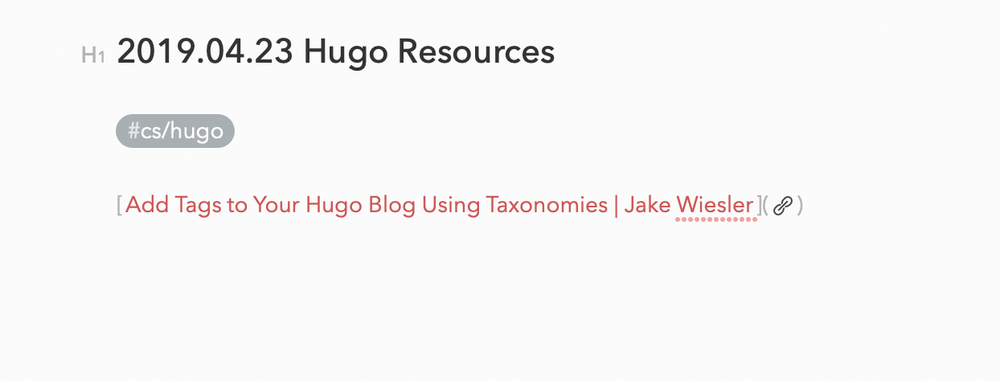

# vscode-paste-link-with-title-markdown
this is a simple extension to smartly grab the title of a link and post the link encapsulated in markdown link syntax complete with the title

the goal is to achieve this effect:

